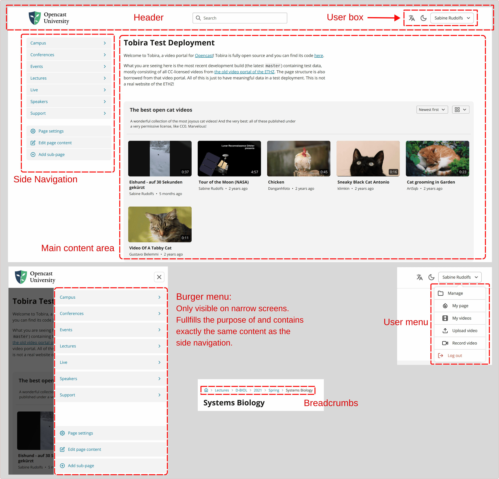

# Semantics and definitions

This document is a loose collection of various additional information, defining some terms and explaining how some details of Tobira work.
This hopefully enables more precise communication in Tobira-related discussions.

## Common UI elements

## Content Pages

Tobira contains a hierarchy of *content pages*, collectively also called the *page tree*.
There is one root *content page* (also called home page or start page), which is the first thing you see when visiting Tobira.
Each *content page* can have sub-*content pages*, which page-moderators can add and remove.
Each *content page* has a name (which is shown at the very top) and contains an ordered list of "content blocks".
Currently, there are title blocks, text blocks, series blocks and video blocks.

In Tobira's user-facing UI, *content pages* are simply called "pages".
But as "page" is a very generic term, this document will use the term *content page* to specifically refer to these user-editable pages described in this section.

In addition to this main page tree, each user (who is allowed to as per `auth.user_realm_role` configuration) can create and manage their own page tree.
These *content pages* are called "user pages".
User pages (and content only included on user pages) do not appear in the search or anywhere in the main page tree; one has to know the username or link to a user page in order to visit it.

## Video Pages

The main place to watch a video is the video page.
It contains the video player, the video's metadata, and buttons to share and (optionally) download the video.
If the video is part of a series, the other videos of that series are shown at the bottom.

A video page can be reached via two different means: via direct link or coming from a *content page*.
This only affects the navigation and breadcrumbs.
See the next chapter for more information on this.

## Routes

Different routes exist in Tobira to access *content pages*, videos, the management section, or other features of Tobira.
The values `in this style` are the URL paths, e.g. what the browser will show after your domain (e.g. `tobira.my-university.de`) when visiting that route.

- **Main content pages**: `/<path/to/page>`.
  Shows a *content page* in the page tree.
  There are certain limitations on the path segments that can be used here in order to not collide with the routes defined below.
  Examples:
    - `/` (*home page*)
    - `/conferences`
    - `/lectures/biology/2023`

- **User pages**: `/@<userid>/<path/to/page>`.
  Shows a user page.
  They always start with `/@` and then the user ID of the owning user.
  Examples:
    - `/@peter` (user *root* page)
    - `/@peter/math-explanations`

- **Videos in context**: `/<path/to/page>/v/<videoid>`.
  Shows a video with *page context* (meaning: a video or its series is included on a *content page*).
  The navigation of that *content page* is shown.
  This is the normal route you reach by clicking on a video included in a *content page*.
  Also works for user pages.
  Examples:
    - `/lectures/biology/2023/v/L5CUekz9uQ0`
    - `/v/ENIGYvfETox`
    - `/@peter/dance-lessons/v/HFl9DghSw4x`

- **Video direct links**: `/!v/<videoid>` or `/!v/:<oc_id>`.
  Shows a video without *page context*.
  The home page navigation is shown.
  Useful when the video is not included in any *content page* yet, or if you want to generate a link from an Opencast ID.
  Examples:
    - `/!v/L5CUekz9uQ0`
    - `/!v/:25e82f02-db10-4ba6-937f-3252353cfbe8` (Opencast ID prefixed with `:`)

- **Series direct links**: `/!s/<seriesid>` or `/!s/:<oc_id>`. Exactly like video direct links, but for series.

- **Management routes**: `/~manage/<...>` and `/~upload`. For various "management" pages, like "my videos" or modifying a *content page*.

- **Other internal routes**: `/~<...>`, e.g. `/~about`.

## "Listed" and being findable via search

User pages *cannot* be found via search.
Non-user content pages *can* be found via search.
For videos and series, it gets more complicated.

The findability for both depends on whether they are included in a *content page*.
Included means that a content block (the things you can put on a *content page*) refers to them.
A video is "included in a content page" if that content page has a video block with that video, or a series block with that video's series.
Similarly, a series is included in a content page, if a series block refers to it or if a video block refers to any of its videos.

If and only if a video/series is included in any non-user content page, it is findable via search.
(Note: currently, series are not findable via search at all, but simply because it was not implemented yet. The described rules will be used in the future.)

## Permissions in Tobira

There are a number of special roles that grant users the permission to perform certain actions in Tobira.
All these roles can be configured in `auth.roles`.

| Config | Permissions |
| ------ | ----------- |
| `roles.upload` | Can use Tobira's uploader |
| `roles.studio` | Can use Studio from Tobira |
| `roles.editor` | Can use the Editor from Tobira |
| `roles.user_realm` | Can create own user page |
| `roles.can_find_unlisted` | Can find unlisted items when editing page content |
| `roles.global_page_admin` | Is *page admin* on all non-user content-pages |
| `roles.global_page_moderator` | Is *page moderator* on all non-user content-pages |
| `roles.tobira_admin` | Is *Tobira admin* and can do all of the above |

For content-pages, permissions can be given to users and groups via the UI.
Permissions are inherited down the page tree.
There are currently three permission levels:

| Name | Permissions |
| ---- | ----------- |
| *None* | Can only see the page, but not edit in any way |
| Page moderator | Can edit content, rename, change sub-page order and add new sub pages |
| Page admin | Can do everything: all page moderator permissions plus deleting the content-page, changing its path and changing page permissions |
