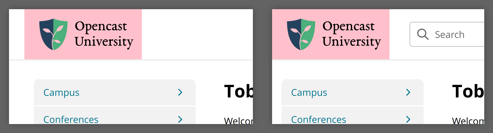

# Theme: Logo, Font & Colors

This document will explain how to best adjust the `[theme]` configuration.
If you have no experience in UI design and are not familiar with your organization's CI, you usually want to talk to such a person and do this part of the configuration together.


## Logo & Header height

The logo image file (SVG recommended) has to contain all required margin.
Tobira does not add any space around the logo at all.
There might be space to the right or left, depending on the screen size, but do not count on it!
In the following image, the logo file has a pink background color to show you its size and the margin included in it.



Once the logo file is created and configured, adjust `header_height` to your liking.
This is the height of the header (and thus also your logo) in pixels.
Only the logo is stretched, all other elements are vertically centered within the header.

You can also configure a second logo file as `logo.small` which is used for narrow screens (e.g. phones).
This is usually roughly square.
We strongly recommend setting this smaller logo, as otherwise, the main logo (especially if it is very wide) might get shrunk on narrow screens in order to still show the other elements in the header.

You should also test if the logo is  properly configured for dark mode:
- To use a different image for dark mode, set `logo.large_dark` and `logo.small_dark` appropriately.
- If your normal logo already works well for dark mode, set `logo.large_dark` and `logo.small_dark` to the same values as `large` and `small`, respectively.
- If `logo.large_dark` and `logo.small_dark` are not set, `large` and `small` are used, but with all colors inverted. This might work for you in special cases, e.g. if your logo is fully black or transparent.


## Favicon

The favicon is a single SVG file, that's usually a simplified version of your logo.
It is shown as tiny image in browser tabs, the browser's history or a bookmark list.

## Font

You can change the main font used by Tobira.
The relevant config section is `theme.font` – see the comments there for specifics on the individual values.
The following goes over three different ways of changing the font.

If you want to use a font that you expect most of your users to already have installed on their devices, you can just set `font.main_family`.
For example: `font.main_family = "Arial"` (please don't actually use Arial though).
The `main_family` value is used as the value for the CSS `font-family` declaration, which has two consequences.
For one, you have to quote font names with spaces, e.g. `font.main_family = "'Noto Sans'"`.
More importantly, you can use multiple values to let the browser choose the first one that's available, for example:
`font.main_family = "Papyrus, Helvetica, 'Noto Sans'"`.
Tobira will always add `sans-serif` at the very end as a fallback.

But you cannot assume anything about the fonts installed on a user's device.
So to be sure a particular font is used, it has to be provided.
Tobira always provides "Open Sans", its default font. So you can just mention `'Open Sans'` in `main_family` to be sure that that is used as a fallback.
But you can also provide your own fonts by specifying `font.extra_css`, a CSS file that is expected to contain `@font-face` declarations.
As examples, you can look at the Google Font files, e.g. [this for Montserrat](https://fonts.googleapis.com/css2?family=Montserrat:wght@100..900&display=swap).
You could download that CSS file from Google (this is not legal advice) and specify it as `extra_css`, then set `main_family = "Montserrat"` and be sure that the user's browser can display that font.

But said CSS file refers to Google Font servers via `url()`.
You likely don't want that, so you can also instruct Tobira to host font files for you.
These you have to specify as `font.files`.
Tobira will serve them under `/~assets/fonts/`.
So you can then just use links to the Tobira hosted files in your CSS file.
Try encoding your fonts in the WOFF2 format, as this is widely supported and well compressed.

Finally, here is a full example of self-hosted custom fonts:

```toml title=config.toml
[theme.font]
main_family = "'My Fancy Font', 'Open Sans'"
extra_css = "font.css"
files = [
    "font/MyFancyFont-Regular.woff2",
    "font/MyFancyFont-Bold.woff2",
]
```

```css title=font.css
@font-face {
  font-family: 'My Fancy Font';
  font-style: normal;
  font-weight: 400;
  font-display: swap;
  src: url(/~assets/fonts/MyFancyFont-Regular.woff2) format('woff2');
}
@font-face {
  font-family: 'My Fancy Font';
  font-style: normal;
  font-weight: 700;
  font-display: swap;
  src: url(/~assets/fonts/MyFancyFont-Bold.woff2) format('woff2');
}
```

**Note**:
Tobira is developed with Open Sans in mind and optimized for it.
Other fonts might have different glyph heights and positioning metrics, making them look off in Tobira.
To make your font look good, use CSS properties such as `size-adjust` and `ascent-override` inside your `@font-face` declaration.
Simply compare your configured font to the default Open Sans to see if letter height, baseline and other metrics fit.
See [these docs about `@font-face`](https://developer.mozilla.org/en-US/docs/Web/CSS/@font-face) to see what you can adjust.


## Colors

All colors throughout Tobira's UI are derived from a small set of base colors.
These allow you to change the appearance of Tobira to be closer to your organization's CI.

- **Primary**: Main color that's used for almost everything that's *colored* (i.e. not grey).
- **Danger**: Used for potentially destructive/dangerous actions and error messages. Should be red.
- **Grey** (optional): Base color for all grey tones used. This is only useful if you want a slightly colored grey. This is fully grey (0 saturation) by default.
- **Happy** (optional): Used for call-to-action elements and things associated with something positive. Is equal to the primary color by default and should only be overwritten if your primary color is red, as using red for these elements would lead to user confusion.

Tobira automatically creates variations of these base colors, each having a different *perceived brightness*.
For *grey*, many different variations are created, each with a fixed perceived brightness, some very dark, some very bright.
For the other colors, only a couple darker variations are created.

The perceived brightness of your configured base colors should fall into a range, in order for the UI to have enough contrast to be accessible to those with limited vision.
The allowed perceived brightness ranges:
- Primary: 35% – 46.5%
- Danger: 23% – 46.5%
- Happy: ≥ 35%

You can use [this LCH color picker](https://lch.oklch.com/) to adjust or pick a color.
The "lightness" in there represents the perceived brightness.
So you likely want to paste your organization's CI color into there, check if the lightness is fine and if not, adjust it to be in this range.


### Extra & background information

#### What is perceived brightness?

This term describes how bright a specific color is perceived as by a human with standard vision.
This is non-linear with respect to the light energy (number of photons) and also depends on the colors present in the light, as some colors are perceived as brighter (e.g. green) than others (e.g. blue).

#### How color variations are created

The variations are created by converting the base colors into the LCH color space and then adjusting the `l` channel.
LCH is a perceptually uniform color space and the `l` channel represents the *perceived brightness* (unlike the `l` channel in HSL!).
Changing `l` will only change the perceived brightness, keeping the saturation and hue the same.
The perceived brightness difference between the variations also does not depend on its hue, saturation, or the configured brightness of the base color.
All this is done to get consistent contrast levels between different colors.

